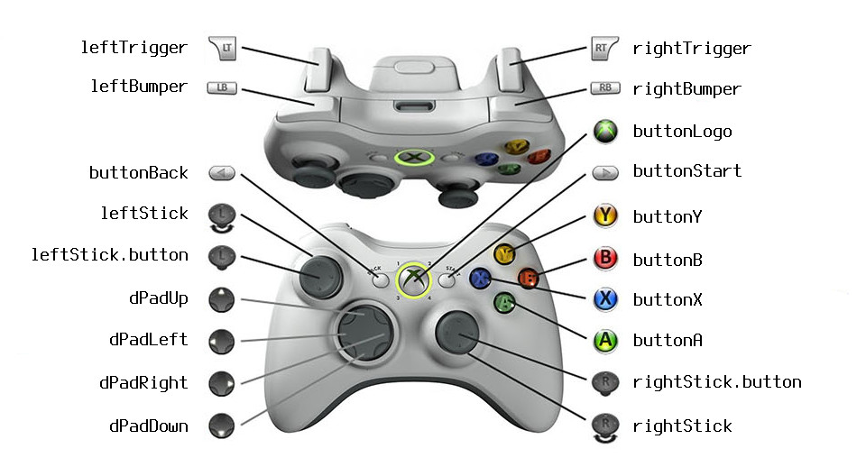

:zap: _**Status:** Experimental API, for elm community discussion._

# elm-gamepad

This package provides an Elm language interface for gamepad input.

It works in most modern browsers with both wired and wireless controllers.

* See [HTML5 Test](https://html5test.com/compare/feature/input.getGamepads.html) to
check browser compatibility.

* Use the [HTML5 Gamepad Tester](http://html5gamepad.com/) to test yours.

* See the [elm-gamepad live demo](http://kfish.github.io/elm-gamepad/) to view
the raw data visible to your Elm application.

Note that to avoid fingerprinting controllers, some browsers only
show them after a button has been pressed.


## Device and operating system support

I'm developing this on Ubuntu Linux and tested it with:

* wired USB controllers on Mac OS X, Ubuntu and Centos
* Bluetooth controllers on Android (in Firefox)

It works out of the box on Linux and Android, and probably Windows.

On Mac OS X you may need to install a driver, such as
[XBox 360 controller driver for OSX](http://tattiebogle.net/index.php/ProjectRoot/Xbox360Controller/OsxDriver).


## Elm interface

A `StandardGamepad` is a record with named fields for buttons
and thumbsticks.

### Button

A `Button` represents the current state of an analog or digital
button or trigger. According to the [spec](https://w3c.github.io/gamepad/):

> All button values must be linearly normalized to the range
> [0.0 .. 1.0]. 0.0 must mean fully unpressed, and 1.0 must
> mean fully pressed. For buttons without an analog sensor, only
> the values 0.0 and 1.0 for fully unpressed and fully pressed
> must be provided.

```elm
type alias Button =
  { pressed : Bool
  , value : Float
  }
```

### Stick

A `Stick` represents a thumbstick with two analog axes `x` and `y`,
and a `Button` for pressing down on the stick.

> All axis values must be linearly normalized to the range
> [-1.0 .. 1.0]. As appropriate, -1.0 should correspond to
> "up" or "left", and 1.0 should correspond to "down" or "right".

```elm
type alias Stick =
    { x : Float
    , y : Float
    , button : Button
    }
```

### StandardGamepad

Most controllers are converted to `StandardGamepad` by your browser and `elm-gamepad`.



```elm
type Gamepad =
      StandardGamepad StandardGamepad_
    | RawGamepad RawGamepad_

type alias StandardGamepad_ =
    { id : String

   , buttonBack   : Button
   , buttonStart  : Button
   , buttonLogo   : Button

   , buttonA : Button
   , buttonB : Button
   , buttonX : Button
   , buttonY : Button

   , leftTrigger    : Button
   , leftBumper     : Button
   , leftStick      : Stick

   , rightTrigger    : Button
   , rightBumper     : Button
   , rightStick      : Stick

   , dPadUp    : Button
   , dPadDown  : Button
   , dPadLeft  : Button
   , dPadRight : Button
   }
```
### RawGamepad

If a controller is unknown it will appear as a `RawGamepad`.

`RawGamepad` is the underlying HTML5 Gamepad representation,
containing lists of `Buttons`, and `floats` for the axes.

Axis values are listed in pairs, X followed by Y.

```elm
type alias RawGamepad_ =
   { id : String
   , axes : List Float
   , buttons : List Button
   , mapping : String
   }
```

<!--
The only defined mapping is "standard":


-->

### Polling for updates

The `Gamepad` module exposes a `Cmd` to request the current state
of connected gamepads. 

```elm
import Gamepad

type alias Model =
    List Gamepad.Gamepad

init : ( Model, Cmd Msg )
init =
    ( [], Gamepad.gamepads GamepadMsg )

...

update : Msg -> Model -> ( Model, Cmd Msg )
update msg model =
    case msg of
        GamepadMsg gamepads ->
            -- In an actual game you would update your player
            -- position here, rather than just returning the
            -- raw gamepad data.
            ( gamepads, Gamepad.gamepads GamepadMsg )
```

## Demo

This package contains a demo application
[ShowGamepad.elm](ShowGamepad.elm)
which displays the raw Gamepad type.
An instance is running [here](http://kfish.github.io/elm-gamepad/).

### Build locally

To view it locally, clone this repository and run elm-reactor:

```
$ git clone https://github.com/kfish/elm-gamepad.git
$ cd elm-gamepad
$ elm-package install
$ elm-reactor
```

## Installation

This package contains experimental Native code. It is not yet
whiteliested for inclusion in the Elm package archive. To use
it in your package you will need to use an unofficial installer
like
[elm-install](https://github.com/gdotdesign/elm-github-install)

## History

This package was originally developed by @zimbatm for Elm 0.15. It was updated
for Elm 0.16 by @kfish, and merged into
[Dreambuggy](http://github.com/kfish/dreambuggy/),
where it was updated for Elm versions 0.17 and 0.18.


## Resources

 * [W3C Gamepad specification](https://w3c.github.io/gamepad/)
